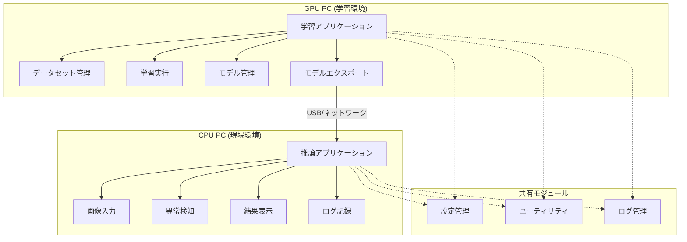

# 機能要件書

**汎用的AI画像解析異常検知システム**

## 📋 文書情報

| 項目 | 内容 |
|------|------|
| 文書名 | 機能要件書 |
| バージョン | 1.0 |
| 作成日 | 2024年12月19日 |
| 最終更新 | 2024年12月19日 |
| 対象システム | 汎用的AI画像解析異常検知システム |
| 対象フェーズ | Phase1 (MVP) ～ Phase3 (完全版) |

## 🎯 目的

本文書は、工場生産ライン向けAI画像解析異常検知システムの機能要件を定義し、開発チーム（特に新卒メンバー）が明確な目標を持って開発を進められるようにすることを目的とします。

## 📊 システム概要

### 基本コンセプト
- **オフライン動作**: インターネット接続不要の完全自立システム
- **分離型構成**: 学習アプリケーション（GPU PC）と推論アプリケーション（CPU PC）の分離
- **段階的展開**: Phase1 (MVP) → Phase2 (拡張) → Phase3 (完全版)
- **新卒対応**: 分かりやすいUI/UX、充実したログ・ドキュメント

### 技術スタック
- **AI/ML**: anomalib（異常検知）、OpenVINO（推論最適化）
- **UI**: Tkinter（デスクトップアプリケーション）
- **データ**: MVTec AD（開発用）、カスタムデータセット（本番用）
- **設定管理**: YAML設定ファイル、階層化設定

## 🏗️ システム構成

### アプリケーション構成

## 📋 機能要件詳細

## 1. 学習アプリケーション機能要件

### 1.1 データセット管理機能

#### 1.1.1 Phase1 (MVP) 要件
**優先度**: 最高 🔴

| 機能ID | 機能名 | 機能概要 | 受入条件 |
|--------|-------|---------|----------|
| DS-01 | MVTec bottle データセット対応 | MVTec ADのbottleカテゴリのみ対応 | bottleカテゴリの学習・テストデータを正常に読み込める |
| DS-02 | 基本ディレクトリ構造作成 | train/good, test/good, test/異常タイプの構造自動作成 | 必要なディレクトリが自動作成される |
| DS-03 | データセット検証 | 配置されたデータの整合性確認 | 不正・不足データを検出し警告表示 |
| DS-04 | 画像パス一覧取得 | 学習・テスト用画像のパス一覧を取得 | 正常・異常画像のパスを正確に取得 |

#### 1.1.2 Phase2 拡張要件
**優先度**: 高 🟡

| 機能ID | 機能名 | 機能概要 | 受入条件 |
|--------|-------|---------|----------|
| DS-05 | 複数カテゴリ対応 | bottle, cable, capsule の3カテゴリ対応 | 3カテゴリの並行管理が可能 |
| DS-06 | カテゴリ別統計表示 | 各カテゴリの画像数・異常タイプ統計 | カテゴリ別詳細統計をGUIで表示 |
| DS-07 | データ品質評価 | 画像品質・解像度・形式の自動チェック | 品質問題のある画像を特定・報告 |

#### 1.1.3 Phase3 完全版要件  
**優先度**: 中 🟢

| 機能ID | 機能名 | 機能概要 | 受入条件 |
|--------|-------|---------|----------|
| DS-08 | 全カテゴリ対応 | MVTec AD全15カテゴリ対応 | 全カテゴリの統合管理 |
| DS-09 | カスタムデータセット対応 | 工場固有データセットの追加・管理 | 独自カテゴリの定義・管理 |
| DS-10 | データ前処理自動化 | リサイズ・正規化・拡張の自動実行 | 前処理パイプラインの自動実行 |
| DS-11 | データバックアップ管理 | 自動バックアップ・復元機能 | ワンクリックでのバックアップ作成・復元 |

### 1.2 学習実行機能

#### 1.2.1 Phase1 (MVP) 要件
**優先度**: 最高 🔴

| 機能ID | 機能名 | 機能概要 | 受入条件 |
|--------|-------|---------|----------|
| TR-01 | 基本学習実行 | anomalibを使用したbottle異常検知学習 | 学習が正常に完了し、モデルが生成される |
| TR-02 | 学習進捗表示 | プログレスバー・ログによる進捗可視化 | リアルタイムで学習状況を確認可能 |
| TR-03 | 簡易評価 | 基本的な精度指標（AUC、F1スコア）表示 | 学習完了時に評価結果を表示 |
| TR-04 | エラーハンドリング | 学習中断・エラー時の適切な処理 | エラー発生時に分かりやすいメッセージ表示 |

#### 1.2.2 Phase2 拡張要件
**優先度**: 高 🟡

| 機能ID | 機能名 | 機能概要 | 受入条件 |
|--------|-------|---------|----------|
| TR-05 | ハイパーパラメータ調整 | バッチサイズ・学習率等の調整UI | GUIでパラメータを調整可能 |
| TR-06 | 学習履歴管理 | 過去の学習結果・設定の保存・参照 | 学習履歴をデータベース的に管理 |
| TR-07 | 複数カテゴリ並行学習 | 3カテゴリの並行または順次学習 | カテゴリ別学習の並行実行 |
| TR-08 | 詳細評価レポート | 混同行列・ROC曲線等の詳細評価 | 包括的な評価レポートの自動生成 |

#### 1.2.3 Phase3 完全版要件
**優先度**: 中 🟢

| 機能ID | 機能名 | 機能概要 | 受入条件 |
|--------|-------|---------|----------|
| TR-09 | 自動ハイパーパラメータ最適化 | グリッドサーチ・ベイズ最適化 | 最適パラメータの自動探索 |
| TR-10 | アンサンブル学習 | 複数モデルの組み合わせ学習 | アンサンブルモデルの自動構築 |
| TR-11 | 転移学習対応 | 事前学習済みモデルの活用 | 転移学習によるカスタムデータ対応 |
| TR-12 | 分散学習対応 | 複数GPU・複数PCでの分散学習 | スケーラブルな学習環境 |

### 1.3 モデル管理機能

#### 1.3.1 Phase1 (MVP) 要件
**優先度**: 最高 🔴

| 機能ID | 機能名 | 機能概要 | 受入条件 |
|--------|-------|---------|----------|
| MD-01 | モデル保存 | 学習済みモデルのローカル保存 | 指定ディレクトリへの確実な保存 |
| MD-02 | OpenVINO変換 | 推論最適化のためのIR形式変換 | CPU推論用最適化モデルの生成 |
| MD-03 | モデル基本情報表示 | 作成日時・精度・サイズ等の基本情報 | モデル一覧での基本情報表示 |
| MD-04 | モデルエクスポート | USB/ネットワーク経由での配布準備 | パッケージ化されたモデルファイル |

#### 1.3.2 Phase2 拡張要件
**優先度**: 高 🟡

| 機能ID | 機能名 | 機能概要 | 受入条件 |
|--------|-------|---------|----------|
| MD-05 | モデル比較機能 | 複数モデルの性能比較 | 並列比較表示・グラフ化 |
| MD-06 | モデルバージョン管理 | バージョン履歴・ロールバック機能 | Git的なバージョン管理 |
| MD-07 | モデル説明情報 | 学習条件・データ・備考の詳細管理 | メタデータの包括的管理 |
| MD-08 | 自動モデル選択 | 精度・サイズ等の条件による自動選択 | 最適モデルの自動推奨 |

#### 1.3.3 Phase3 完全版要件
**優先度**: 中 🟢

| 機能ID | 機能名 | 機能概要 | 受入条件 |
|--------|-------|---------|----------|
| MD-09 | モデル圧縮・量子化 | 軽量化・高速化最適化 | 産業PC向けの軽量モデル |
| MD-10 | A/Bテスト管理 | 本番環境でのモデル性能比較 | 段階的展開・ロールバック |
| MD-11 | モデル監視・診断 | 性能劣化・ドリフト検出 | 継続的モデル品質監視 |
| MD-12 | 自動再学習トリガー | 性能劣化時の自動再学習実行 | 自律的モデルメンテナンス |

## 2. 推論アプリケーション機能要件

### 2.1 画像入力機能

#### 2.1.1 Phase1 (MVP) 要件
**優先度**: 最高 🔴

| 機能ID | 機能名 | 機能概要 | 受入条件 |
|--------|-------|---------|----------|
| IN-01 | ファイル画像読み込み | PNG/JPEGファイルの単体読み込み | ドラッグ&ドロップまたはファイル選択 |
| IN-02 | 基本前処理 | リサイズ・正規化処理 | 学習時と同じ前処理の自動適用 |
| IN-03 | 画像表示 | 読み込み画像のプレビュー表示 | 読み込み画像の確認表示 |
| IN-04 | エラーハンドリング | 不正ファイル・読み込みエラーの処理 | 分かりやすいエラーメッセージ |

#### 2.1.2 Phase2 拡張要件
**優先度**: 高 🟡

| 機能ID | 機能名 | 機能概要 | 受入条件 |
|--------|-------|---------|----------|
| IN-05 | バッチ画像処理 | 複数画像の一括読み込み・処理 | フォルダ指定での一括処理 |
| IN-06 | カメラ連携 | USBカメラ・産業用カメラとの連携 | リアルタイム画像取得 |
| IN-07 | 画像履歴管理 | 処理済み画像の履歴表示・検索 | 時系列での画像履歴管理 |
| IN-08 | 前処理設定UI | 前処理パラメータのリアルタイム調整 | プレビュー付き前処理調整 |

#### 2.1.3 Phase3 完全版要件
**優先度**: 中 🟢

| 機能ID | 機能名 | 機能概要 | 受入条件 |
|--------|-------|---------|----------|
| IN-09 | ライン統合 | 生産ライン機器との直接連携 | PLC・産業ネットワーク対応 |
| IN-10 | 連続監視モード | 24時間連続画像監視・処理 | 安定した長時間動作 |
| IN-11 | 品質管理統合 | QCシステムとの連携 | 品質管理データベース連携 |
| IN-12 | 高度画像処理 | ノイズ除去・エッジ強調等の前処理 | 画質改善による精度向上 |

### 2.2 異常検知実行機能

#### 2.2.1 Phase1 (MVP) 要件
**優先度**: 最高 🔴

| 機能ID | 機能名 | 機能概要 | 受入条件 |
|--------|-------|---------|----------|
| AD-01 | 基本異常検知 | 学習済みモデルによる異常判定 | 正常/異常の2値判定 |
| AD-02 | 信頼度表示 | 異常判定の確信度スコア表示 | 0-100%での信頼度可視化 |
| AD-03 | 処理時間表示 | 1画像あたりの処理時間表示 | ms単位での処理時間計測 |
| AD-04 | 基本ログ出力 | 判定結果の基本ログ記録 | 日時・画像・結果の記録 |

#### 2.2.2 Phase2 拡張要件
**優先度**: 高 🟡

| 機能ID | 機能名 | 機能概要 | 受入条件 |
|--------|-------|---------|----------|
| AD-05 | 異常領域可視化 | ヒートマップによる異常箇所表示 | 異常部位の視覚的ハイライト |
| AD-06 | 閾値設定UI | 異常判定閾値のリアルタイム調整 | GUI上での閾値調整・プレビュー |
| AD-07 | 複数モデル比較 | 異なるモデルでの並行判定 | モデル間での判定結果比較 |
| AD-08 | 統計ダッシュボード | 異常検知統計の可視化 | 時系列グラフ・統計サマリー |

#### 2.2.3 Phase3 完全版要件
**優先度**: 中 🟢

| 機能ID | 機能名 | 機能概要 | 受入条件 |
|--------|-------|---------|----------|
| AD-09 | 異常タイプ分類 | 異常の種類別分類・報告 | 詳細な異常分類機能 |
| AD-10 | 確信度学習 | 判定結果のフィードバック学習 | 継続的な精度改善 |
| AD-11 | 自動アラート | 異常検知時の自動通知・警告 | メール・音声・ライト等での通知 |
| AD-12 | 予測保全 | 異常パターンによる故障予測 | 予防保全のための予測機能 |

### 2.3 結果表示・ログ機能

#### 2.3.1 Phase1 (MVP) 要件
**優先度**: 最高 🔴

| 機能ID | 機能名 | 機能概要 | 受入条件 |
|--------|-------|---------|----------|
| RS-01 | 判定結果表示 | 正常/異常の明確な表示 | 大きく分かりやすい結果表示 |
| RS-02 | 基本ログ記録 | 判定結果・時刻の記録 | CSV形式での基本ログ出力 |
| RS-03 | 画像保存 | 判定済み画像の自動保存 | 結果と画像の関連付け保存 |
| RS-04 | 簡易レポート | 日次・週次の基本統計 | 異常件数・検知率の基本統計 |

#### 2.3.2 Phase2 拡張要件
**優先度**: 高 🟡

| 機能ID | 機能名 | 機能概要 | 受入条件 |
|--------|-------|---------|----------|
| RS-05 | 詳細ログ管理 | 構造化ログ・検索・フィルタ機能 | 高度なログ検索・分析 |
| RS-06 | データエクスポート | Excel・PDF形式でのレポート出力 | 多様な形式でのデータ出力 |
| RS-07 | 視覚的ダッシュボード | グラフ・チャートでの統計表示 | 直感的な統計情報表示 |
| RS-08 | 履歴管理機能 | 過去データの参照・比較 | 時系列での性能推移確認 |

#### 2.3.3 Phase3 完全版要件
**優先度**: 中 🟢

| 機能ID | 機能名 | 機能概要 | 受入条件 |
|--------|-------|---------|----------|
| RS-09 | 高度分析レポート | 統計分析・傾向分析レポート | データサイエンス的分析 |
| RS-10 | リアルタイム監視 | ライブダッシュボード・アラート | 24時間監視体制対応 |
| RS-11 | 外部システム連携 | ERP・MES等との連携 | 既存システムとの統合 |
| RS-12 | AI説明可能性 | 判定根拠の可視化・説明 | 判定理由の透明性確保 |

## 3. 共通機能要件

### 3.1 設定管理機能

#### 3.1.1 共通要件 (全Phase)
**優先度**: 最高 🔴

| 機能ID | 機能名 | 機能概要 | 受入条件 |
|--------|-------|---------|----------|
| CF-01 | YAML設定管理 | 階層化YAML設定ファイル管理 | 設定の読み込み・保存・検証 |
| CF-02 | 環境別設定 | 開発・本番環境の設定分離 | 環境切り替えの自動化 |
| CF-03 | 設定検証 | 設定値の妥当性チェック | 不正設定の検出・警告 |
| CF-04 | 設定バックアップ | 設定変更の履歴・ロールバック | 設定変更の安全な管理 |

### 3.2 ログ管理機能

#### 3.2.1 共通要件 (全Phase)
**優先度**: 最高 🔴

| 機能ID | 機能名 | 機能概要 | 受入条件 |
|--------|-------|---------|----------|
| LG-01 | 構造化ログ | JSON形式での構造化ログ出力 | 機械可読なログ形式 |
| LG-02 | ログレベル管理 | DEBUG/INFO/WARN/ERROR/CRITICALレベル | 適切なログレベル分類 |
| LG-03 | ログローテーション | 日次・サイズ別ログファイル分割 | ディスク容量管理 |
| LG-04 | ログ検索・フィルタ | 条件による高速ログ検索 | 効率的なトラブルシューティング |

### 3.3 ユーティリティ機能

#### 3.3.1 共通要件 (全Phase)
**優先度**: 高 🟡

| 機能ID | 機能名 | 機能概要 | 受入条件 |
|--------|-------|---------|----------|
| UT-01 | ファイル操作 | 安全なファイル操作ユーティリティ | エラーハンドリング付きファイル操作 |
| UT-02 | データ変換 | 各種形式間のデータ変換 | CSV/JSON/YAML等の相互変換 |
| UT-03 | 画像処理 | 汎用画像処理ユーティリティ | リサイズ・変換・検証等 |
| UT-04 | システム監視 | CPU・メモリ・ディスク使用量監視 | リソース監視・アラート |

## 4. 非機能要件

### 4.1 性能要件

| 項目 | Phase1 (MVP) | Phase2 (拡張) | Phase3 (完全版) |
|------|-------------|-------------|---------------|
| 推論速度 | < 1秒/画像 | < 500ms/画像 | < 200ms/画像 |
| 学習時間 | < 30分 (bottle) | < 2時間 (3カテゴリ) | < 8時間 (全カテゴリ) |
| メモリ使用量 | < 4GB (推論) | < 8GB (推論) | < 16GB (推論) |
| ディスク容量 | < 10GB | < 50GB | < 200GB |
| 同時処理数 | 1画像 | 5画像 | 50画像 |

### 4.2 可用性要件

| 項目 | 要件 | 備考 |
|------|-----|------|
| 稼働率 | 99.5% (推論アプリ) | 8時間/日運用想定 |
| 復旧時間 | < 5分 | システム再起動含む |
| バックアップ頻度 | 日次自動 | モデル・設定・ログ |
| 障害検知時間 | < 1分 | 自動監視機能 |

### 4.3 セキュリティ要件

| 項目 | 要件 | 実装方法 |
|------|-----|---------|
| アクセス制御 | ユーザー認証・権限管理 | ローカルユーザー管理 |
| データ保護 | 学習データ・モデルの暗号化 | AES256暗号化 |
| ログ保護 | ログファイルの改ざん防止 | ハッシュ検証 |
| 外部通信 | 最小限の外部通信 | 設定可能な制限 |

### 4.4 保守性要件

| 項目 | 要件 | 実装方法 |
|------|-----|---------|
| ログ可視化 | 問題特定の容易さ | 構造化ログ・検索機能 |
| 設定管理 | 設定変更の安全性 | バリデーション・バックアップ |
| モジュール分離 | 独立性・再利用性 | 疎結合設計 |
| テスト容易性 | 単体・結合テスト対応 | モック・テストデータ |

### 4.5 ユーザビリティ要件

| 項目 | 要件 | 対象ユーザー |
|------|-----|------------|
| 学習曲線 | 新卒1日で基本操作習得 | 開発チーム |
| 操作性 | 工場作業者30分で習得 | 現場オペレーター |
| エラー理解 | 非技術者にも分かるメッセージ | 保守・運用担当者 |
| ヘルプ機能 | 文脈に応じたヘルプ表示 | 全ユーザー |

## 5. システム間連携要件

### 5.1 学習・推論アプリ間連携

| 項目 | 要件 | 実装方法 |
|------|-----|---------|
| モデル配布 | USB・ネットワーク経由 | パッケージ化・自動展開 |
| 設定同期 | 学習時設定の推論側反映 | 設定ファイル同梱 |
| バージョン管理 | モデル・設定のバージョン追跡 | メタデータ管理 |
| 互換性確認 | 新旧モデルの互換性チェック | バージョン検証 |

### 5.2 外部システム連携（Phase3）

| 項目 | 要件 | 実装方法 |
|------|-----|---------|
| データベース連携 | 検知結果のDB保存 | ODBC/SQLite対応 |
| MESシステム連携 | 製造実行システムとの連携 | API・CSV連携 |
| 通知システム | 異常検知時の自動通知 | メール・Slack等 |
| 品質管理システム | QCデータとの連携 | 標準フォーマット対応 |

## 6. 開発・運用要件

### 6.1 開発環境要件

| 項目 | 要件 | 備考 |
|------|-----|------|
| OS対応 | Windows 10/11 | 工場PC環境に合わせ |
| Python版 | 3.8-3.11 | anomalib互換性 |
| GPU要件 | NVIDIA GPU (学習用) | CUDA対応 |
| CPU要件 | Intel Core i5以上 (推論用) | 産業PC想定 |
| メモリ | 8GB以上 (学習), 4GB以上 (推論) | 一般的な産業PC仕様 |

### 6.2 配置・運用要件

| 項目 | 要件 | 実装方法 |
|------|-----|---------|
| インストール | ワンクリックインストール | インストーラー作成 |
| アップデート | 段階的アップデート対応 | バージョン管理・移行 |
| バックアップ | 自動バックアップ・復元 | スケジュール実行 |
| 監視・診断 | 健全性チェック機能 | 自己診断・レポート |

## 7. テスト要件

### 7.1 テスト対象

| テスト種別 | 対象機能 | 実行タイミング |
|-----------|---------|--------------|
| 単体テスト | 各モジュール・関数 | 開発時 |
| 結合テスト | モジュール間連携 | 機能完成時 |
| システムテスト | エンドツーエンド | Phase完成時 |
| 受入テスト | ユーザーシナリオ | 納品前 |
| 性能テスト | 速度・負荷 | 各Phase |
| セキュリティテスト | 脆弱性 | Phase3 |

### 7.2 テストデータ

| データ種別 | 用途 | 要件 |
|-----------|-----|-----|
| 正常画像 | 学習・検証 | 各カテゴリ100枚以上 |
| 異常画像 | 学習・検証 | 各異常タイプ50枚以上 |
| 境界ケース | 閾値テスト | グレーゾーン画像 |
| 不正データ | エラーテスト | 破損・形式違い画像 |

## 8. 受入基準

### 8.1 Phase1 (MVP) 受入基準

✅ **必須要件**
- [ ] bottleカテゴリでの異常検知が動作
- [ ] 学習アプリで基本学習が完了
- [ ] 推論アプリで画像判定が動作  
- [ ] 基本ログが出力される
- [ ] 新卒が1日で操作習得

✅ **品質基準**
- [ ] 異常検知精度 > 90%
- [ ] 推論速度 < 1秒/画像
- [ ] 8時間連続動作可能
- [ ] エラー発生時の適切な処理

### 8.2 Phase2 拡張受入基準

✅ **必須要件**
- [ ] 3カテゴリ（bottle/cable/capsule）対応
- [ ] バッチ処理機能
- [ ] 詳細ログ・レポート機能
- [ ] カメラ連携機能

✅ **品質基準**
- [ ] 異常検知精度 > 95%
- [ ] 推論速度 < 500ms/画像
- [ ] 5画像同時処理
- [ ] 24時間連続動作

### 8.3 Phase3 完全版受入基準

✅ **必須要件**
- [ ] 全15カテゴリ対応
- [ ] カスタムデータセット対応
- [ ] 外部システム連携
- [ ] 自動監視・アラート

✅ **品質基準**
- [ ] 異常検知精度 > 98%
- [ ] 推論速度 < 200ms/画像
- [ ] 50画像同時処理
- [ ] 99.5%稼働率

## 9. 制約事項・前提条件

### 9.1 技術的制約

- **オフライン動作**: インターネット接続に依存しない設計
- **GPU依存**: 学習はNVIDIA GPU必須
- **Windows限定**: 工場環境に合わせたWindows専用
- **ローカルストレージ**: クラウドストレージ使用不可

### 9.2 運用制約

- **作業者スキル**: AI専門知識不要で操作可能
- **保守体制**: 社内エンジニア対応可能な技術レベル
- **セキュリティ**: 外部ネットワーク接続制限
- **予算制約**: 追加ライセンス費用最小化

### 9.3 データ制約

- **データ形式**: PNG/JPEG画像のみ
- **画像サイズ**: 256x256ピクセル標準
- **データ容量**: 学習用50GB、推論用10GB上限
- **個人情報**: 個人特定可能情報の除外

## 10. 今後の拡張可能性

### 10.1 技術的拡張

- **Deep Learning**: より高度なDLアルゴリズム対応
- **Edge AI**: エッジデバイスでの軽量推論
- **クラウド連携**: オプションでのクラウドAI活用
- **AR/VR**: 拡張現実による結果表示

### 10.2 機能的拡張

- **多言語対応**: 英語・中国語等のUI対応
- **音声検知**: 異常音検知との組み合わせ
- **予測保全**: より高度な故障予測
- **自動改善**: MLOpsによる継続的改善

## 📚 関連ドキュメント

- [開発方針](./DEVELOPMENT_GUIDE.md) - システム全体の開発方針
- [データセット管理](./DATASET_MANAGEMENT.md) - データ管理詳細手順
- [コーディング規約](./CODING_STANDARDS.md) - 開発時の規約
- [UI/UX設計指針](./UI_UX_GUIDELINES.md) - インターフェース設計方針

---

## 📞 問い合わせ先

**開発チーム**: AI画像解析プロジェクトチーム  
**文書管理**: システム開発部  
**最終承認**: プロジェクトマネージャー

> この機能要件書は、アジャイル開発手法に基づき、各フェーズの完了時に見直し・更新を行います。